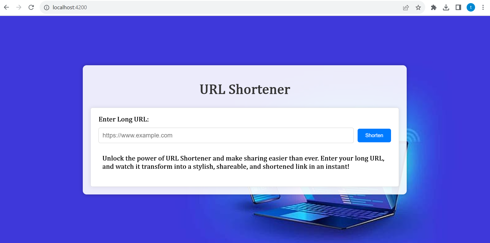
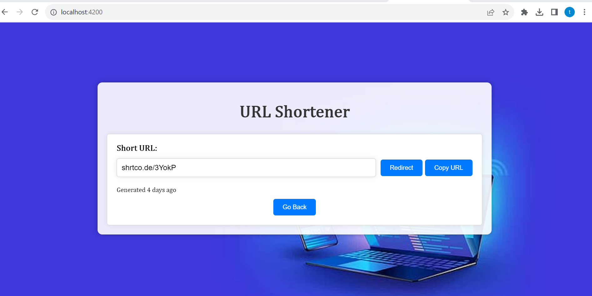

# UrlShortnerApp

A web application using MEAN stack technologies where we can submit a long URL and get a shorten URL in return.

# Setup

1. To run backend 
```
      cd app
      npm install
      node index.js
```

2. To run backend unit testcases
```
      cd app
      npm test
```

3. To test the backend API's using postman, import the file IDASO.postman_collection.json

4. To run frontend 
 ```
    cd client
    npm install
    ng serve
```

5. To run frontend unit testcases
```
    cd client
    ng test
```
6. For accessing URL Shortner Application, go to http://localhost:4200/

7. Once long Url is entered and short url is generated, there are options for redirect to shorturl or to copy the url to clipboard.

 



